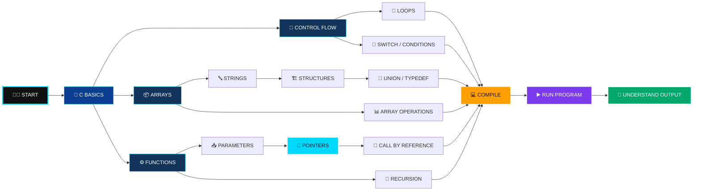
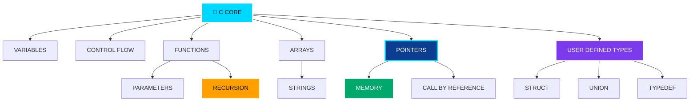
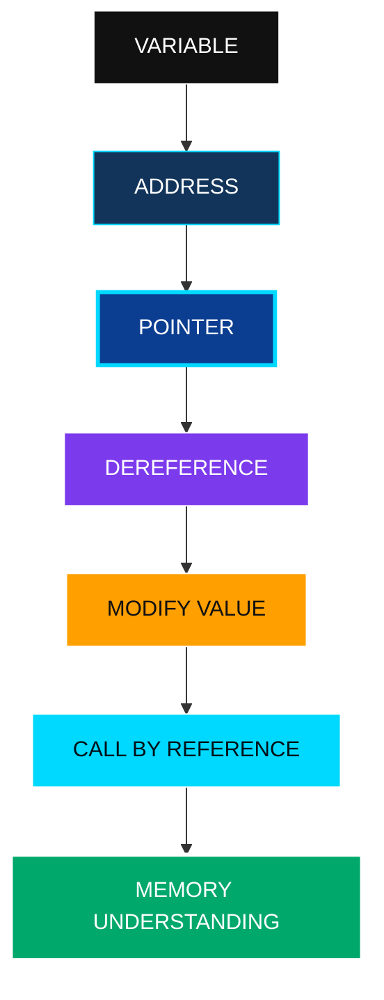

# 🟦 C Programming Course

<div align="center">


### `C LANGUAGE • CORE PROGRAMMING • PRACTICAL EXAMPLES`


<br/>

[](https://en.cppreference.com/w/c)
[](https://github.com/AkshatRaj00/C-Program-Course)
[](LICENSE)

<br/>

**A practical C programming repository with self-contained source files and examples.**

</div>

---

# 🧠 What is this?

**C Program Course** is a practical learning repository containing small, focused C programs for understanding core programming concepts.

The repository is built around **writing code → compiling → running → observing the result** rather than only reading theory.

---

# ⚡ Learning Flow



---

# 📚 Concepts Covered

| Topic | Examples |
|---|---|
| 🟢 Basics | Hello World, input/output, integers |
| 🔀 Conditions | `if`, `else`, `switch` |
| 🔁 Loops | `for`, `while`, `do while` |
| 📦 Arrays | Accessing, changing and passing arrays |
| 🔤 Strings | String handling examples |
| ⚙️ Functions | Declaration, parameters, function calls |
| 🔄 Recursion | Recursive functions |
| 📍 Pointers | Pointer basics and memory references |
| 🔁 Parameter Passing | Call by value / reference |
| 🏗️ Structures | `struct` examples |
| 🔗 Union | `union` examples |
| 🏷️ Typedef | Custom type definitions |
| 🧪 Exercises | Additional practice programs |

---

# 🔥 Core Concepts



---

# 🧩 Repository Examples

```text
C-Program-Course/
│
├── hello.c
├── twonumber.c
├── operation.c
│
├── break.c
├── continue.c
├── for.c
├── while.c
├── dowhile.c
├── switchcase.c
│
├── arrayaccesing.c
├── arraychange.c
├── passingarry.c
│
├── string.c
├── strings.c
│
├── FunctionsDeclaration.c
├── FunctionParameters.c
├── RecursiveFunctions.c
│
├── Pointers.c
├── DanglingPointer.c
├── callbyvalue.c
├── callbyrefrences.c
│
├── structure.c
├── union.c
├── typedef.c
│
├── exercise3.c
│
├── mydirectory/
│   ├── InOut.c
│   ├── coment.c
│   ├── escape.c
│   ├── format.c
│   ├── ifelse.c
│   └── printinteger.c
│
├── docs/
│   └── ARCHITECTURE.md
│
└── LICENSE
```

---

# ⚙️ Compile & Run

## GCC

```bash
gcc hello.c -o hello
```

Run:

```bash
./hello
```

### Windows

```bash
gcc hello.c -o hello.exe
hello.exe
```

### Another example

```bash
gcc Pointers.c -o pointers
./pointers
```

---

# 🧪 Practical Workflow


---

# 🧠 Pointer Learning Path



---

# 🔄 Function & Recursion

```text
FUNCTION
   │
   ├── Declaration
   │
   ├── Parameters
   │
   ├── Arguments
   │
   └── Return Value
           │
           ▼
       RECURSION
           │
           ├── Function calls itself
           ├── Base condition
           └── Recursive execution
```

---

# 🎯 Why Learn C?

```text
C PROGRAMMING
      │
      ├── 🧠 LOGIC
      ├── 🧮 MEMORY
      ├── 📍 POINTERS
      ├── ⚙️ FUNCTIONS
      ├── 🖥️ SYSTEM BASICS
      └── 🔧 LOW-LEVEL THINKING
```

C gives a strong foundation for understanding programming concepts at a lower level.

---

# 🛠️ Tools

| Tool | Purpose |
|---|---|
| `GCC` | Compile C programs |
| `Git` | Version control |
| `GitHub` | Store and share source code |
| `VS Code` | Write and debug C |
| `Terminal` | Compile and execute programs |

---

# 📈 Course Progression

```mermaid
flowchart LR

    A["01<br/>BASICS"] --> B["02<br/>CONTROL FLOW"]
    B --> C["03<br/>ARRAYS & STRINGS"]
    C --> D["04<br/>FUNCTIONS"]
    D --> E["05<br/>RECURSION"]
    E --> F["06<br/>POINTERS"]
    F --> G["07<br/>STRUCTURES"]
    G --> H["08<br/>ADVANCED PRACTICE"]

    style A fill:#111111,stroke:#00d9ff,color:#ffffff
    style B fill:#12345a,stroke:#00d9ff,color:#ffffff
    style C fill:#0b3d91,stroke:#00d9ff,color:#ffffff
    style D fill:#7c3aed,stroke:#ffffff,color:#ffffff
    style E fill:#ff9f00,stroke:#ffffff,color:#111111
    style F fill:#00d9ff,stroke:#ffffff,color:#001018
    style G fill:#00a86b,stroke:#ffffff,color:#ffffff
    style H fill:#111111,stroke:#ffffff,color:#ffffff
```



---

# 🚀 Quick Start

```bash
git clone https://github.com/AkshatRaj00/C-Program-Course.git

cd C-Program-Course

gcc hello.c -o hello

./hello
```

For Windows:

```bash
gcc hello.c -o hello.exe
hello.exe
```

---

# 👨‍💻 Author

<div align="center">


### Akshat Raj

**C Programming • Software Development • AI Engineering**

[](https://github.com/AkshatRaj00)

</div>

---

# 📜 License

This project is licensed under the **MIT License**.

See [`LICENSE`](LICENSE) for details.

---

<div align="center">

### 💻 C PROGRAMMING

**Write Code → Compile → Run → Understand**

<br/>

`Built by Akshat Raj`

</div>
